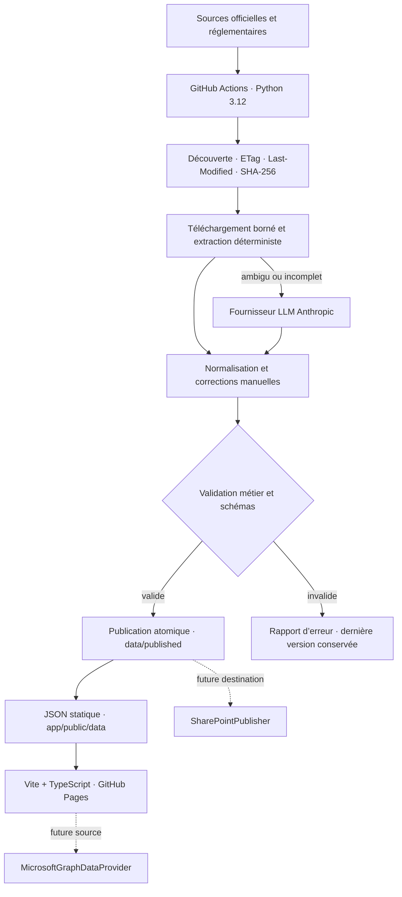

# Architecture V2

## Vue d’ensemble

## Responsabilités

Le frontend valide la forme minimale des trois documents, gère l’état compagnie/période/filtre,
rend avec `textContent` et création DOM explicite, puis exporte toutes les observations publiées.
`DataProvider` masque l’emplacement physique. `StaticJsonDataProvider` est la seule implémentation
actuelle.

Le pipeline charge les YAML, découvre les liens de documents, télécharge avec timeout, reprises,
redirections et taille maximale, puis confie le contenu à l’adaptateur de la société. Les PDF
passent par `pypdf`; le HTML par BeautifulSoup et des expressions contrôlées. Une extraction
Anthropic ne peut fournir qu’un modèle Pydantic strict et reste soumise aux mêmes validations.

`Publisher` isole la destination. `GitHubPagesPublisher` écrit les trois fichiers candidats dans
un répertoire temporaire, puis les remplace ensemble. La future destination SharePoint n’affecte
donc pas la logique d’acquisition.

## Modèle canonique

Une observation conserve une valeur numérique, son unité, une valeur d’affichage française, un
comparatif numérique, la variation recalculée, la direction, la source primaire, son empreinte et
la qualité. Les identifiants suivent `COMPAGNIE-ANNÉE-PÉRIODE-MÉTRIQUE`.

Les actualités conservent leur titre, source, date, résumé original ou généré, catégories,
importance, thèmes et qualité. Le seed garde les 64 observations et 48 actualités de la V1;
`scripts/migrate-v1.mjs` vérifie explicitement ces cardinalités.

## Stratégie LLM et traçabilité

`LlmProvider` permet de remplacer Anthropic plus tard. `NoLlmProvider` rend le mode sans LLM
explicite. Anthropic reçoit un contenu tronqué à la limite configurée, une température nulle, un
schéma JSON et une version de prompt. Les réponses non JSON ou non conformes sont refusées.

Un résultat LLM publié porte fournisseur, modèle, version du prompt, date, tâche, empreinte de la
source, confiance et avertissements dans `quality.llmTrace`. Aucun raisonnement interne n’est
stocké. Les journaux contiennent le modèle, la tâche et l’usage disponible, jamais la clé.

## Last known good

Le pipeline ne publie qu’après validation complète. En cas d’échec d’acquisition, d’extraction,
de correction ou de validation, un rapport `failed` est écrit sous `data/generated/`, le processus
retourne un code non nul et `data/published/` n’est pas modifié. Les contrôles comprennent
identifiants, compagnies, périodes, nombres finis, unités, source primaire, dates futures, HTML,
deltas, directions, volume minimal et baisse anormale.

## Décisions et limites

- Le site demeure entièrement statique; aucun secret ni appel aux assureurs n’existe dans le
  navigateur.
- Aucun framework UI n’est nécessaire pour quatre onglets, quatre cartes et une liste filtrée.
- Les quatre adaptateurs sont volontairement petits; leurs alias doivent être ajustés lorsque les
  gabarits officiels changent.
- Au 11 juillet 2026, la page Manuvie est lisible dans un navigateur mais répond HTTP 403 au
  client automatisé testé. Le pipeline signale ce blocage et protège le last-known-good; il faut
  valider avec Manuvie un point d’accès automatisable ou ajouter une source officielle de repli.
- Les sélecteurs et URL sont couverts par fixtures, mais leur comportement en direct doit être
  surveillé dans le workflow. Une nouvelle mise en page non reconnue échoue de façon visible.
- Le seed V1 possède des valeurs parfois arrondies. Le delta numérique est recalculé sur ces
  valeurs; le delta textuel historique reste conservé pour affichage et audit.

## Extension SharePoint

Deux scénarios sont possibles sans changer le domaine : ajouter un `SharePointPublisher` pour
copier les JSON publiés dans une bibliothèque tout en gardant Pages, ou remplacer Pages par un
frontend utilisant `MicrosoftGraphDataProvider`. Le second nécessitera authentification, règles
CORS et gestion des jetons hors du bundle public. Aucune dépendance Microsoft Graph n’est ajoutée
maintenant.
